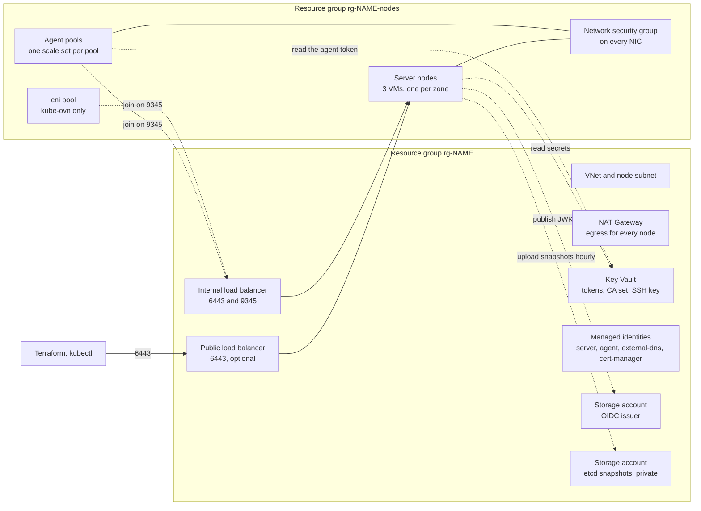

# Architecture

This page shows what the Azure module builds and how the parts connect.

Terms used on every page:

- A **server node** runs the Kubernetes control plane and etcd.
- An **agent node** runs workloads.
- The **registration address** is the internal load balancer. Every node joins the cluster through it.
- **cni-bootstrap** is the module that installs the CNI after this module.

## Resources

## Two resource groups

The first group holds what the module manages on its own. The second group holds the nodes. It also holds what
cloud-provider-azure and the disk CSI driver create: service load balancers, public IPs and disks. The node
identities get Contributor on the second group only.

## Control plane

- Three server nodes, one per zone, as plain VMs. Terraform ignores their cloud-init after creation, so a change
  never replaces all three at once. See [Operations](OPERATIONS.md) to replace one.
- Each server keeps etcd on a Premium SSD v2 data disk of its own, with no host cache. The disk is replaced
  together with its VM. An hourly timer uploads each new etcd snapshot to a private storage account.
- Server nodes carry the taints `CriticalAddonsOnly=true:NoSchedule` and `node-role.kubernetes.io/control-plane=true:NoSchedule`.
- The internal load balancer is the registration address. The public load balancer, when enabled, fronts port
  6443 only and takes the authorized IP ranges.

## Workloads

- Each entry of `agent_pools` is one VM scale set. `node_count` is the initial size. With `min_count` and
  `max_count` the pool gets the tags cluster-autoscaler discovers, and the autoscaler owns the size.
- The kube-ovn profile adds the `cni` pool: one node with the label `kube-ovn/role=master` and the taint
  `kube-ovn.io/control-plane=true:NoSchedule`. ovn-central and kube-ovn-controller run there.
- cluster-autoscaler runs on the server nodes with the server identity. Karpenter does not apply: its Azure
  provider supports AKS only.

## CNI profiles

| `cni`              | RKE2 `cni` | kube-proxy | Dedicated node | cni-bootstrap `cni` |
| ------------------ | ---------- | ---------- | -------------- | ------------------- |
| `cilium` (default) | `none`     | off        | no             | `cilium`            |
| `kube-ovn`         | `none`     | on         | `cni` pool     | `kube-ovn-v2`       |
| `canal`            | `canal`    | on         | no             | not used            |

Canal is the only CNI that RKE2 rebuilds for FIPS.

## The contract

The module emits the contract outputs of the AKS foundation, plus four for RKE2: `distribution`,
`admin_client_certificate`, `admin_client_key` and `cluster_api_port`. The table in the
[root README](../README.md) maps each output to its cni-bootstrap input. Two values differ from AKS on purpose:

- `cluster_api_host` is `127.0.0.1`. Every RKE2 node runs a local API load balancer on port 6443, and Cilium uses it.
- `cni_node_size` is the server count for cilium. cni-bootstrap's node poll then waits for the API before Helm connects.
