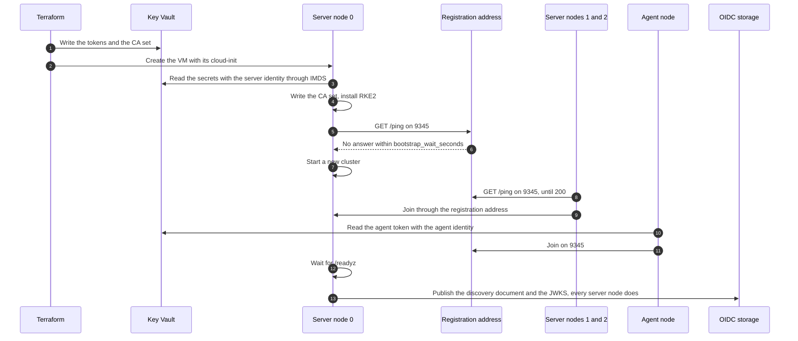
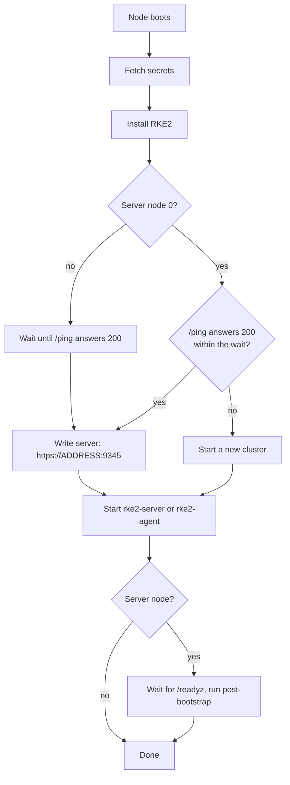

# Bootstrap

This page shows how a node becomes part of the cluster. Nothing on this page needs a CLI on the host that
runs Terraform.

## Sequence

## Start or join

Only server node 0 may start a new cluster. It waits `servers.bootstrap_wait_seconds` for the registration
address. A replaced server node 0 therefore joins the running cluster.

Two servers that join etcd at the same moment make one of them fail its first start with a join deadline
error. systemd restarts the service five seconds later and the second attempt joins. The bootstrap waits for
`/readyz` through it and still ends with `done`.

## Kernel modules on RHEL 10

The Azure Marketplace image of RHEL 10 does not include the iptables kernel modules that kube-proxy and
kube-ovn need. RHEL 10 supplies them in the package `kernel-modules-extra`. The bootstrap installs the build
of that package for the running kernel before it installs RKE2. The RKE2 RPM alone installs the build for the
newest kernel. That kernel runs only after a reboot.

## SELinux

With SELinux on, a pod that runs as `container_t` can write only the host directories labelled
`container_file_t`. The kube-ovn pods are not privileged, and they write their state, log and run directories
on the host. The bootstrap labels the directories in `selinux_container_dirs` with a file context rule. The
directory `/run` is empty at boot, so the bootstrap also adds a tmpfiles entry for the directories under it.
The kube-ovn profile of the Azure module supplies the list.

## Files on a node

| Path                                          | Content                                   | Written by           |
| --------------------------------------------- | ----------------------------------------- | -------------------- |
| `/etc/rancher/rke2/config.yaml`               | RKE2 settings, no secrets                 | cloud-init           |
| `/etc/rancher/rke2/config.yaml.d/00-join.yaml`| `server:` the registration address        | bootstrap.sh         |
| `/etc/rancher/rke2/config.yaml.d/10-token.yaml`| the join token, mode 0600                | bootstrap.sh         |
| `/etc/rancher/node/password`                  | the node password, from the name and the agent token, mode 0600 | bootstrap.sh |
| `/var/lib/rancher/rke2/server/tls/`           | the CA set, mode 0600, servers only       | bootstrap.sh         |
| `/var/lib/rancher/rke2/server/db/`            | the etcd data disk, mounted, servers only | bootstrap.sh         |
| `/var/lib/rancher/rke2/server/manifests/`     | cloud-provider-azure, servers only        | cloud-init           |
| `/etc/rke2-foundation/env`                    | role, addresses, the secret list          | cloud-init           |
| `/etc/tmpfiles.d/rke2-foundation.conf`        | the `/run` directories kube-ovn writes, SELinux hosts only | bootstrap.sh |
| `/usr/local/lib/rke2-foundation/`             | bootstrap.sh, fetch-secrets.sh, post-bootstrap.sh, renew-certificates.sh, upload-snapshots.sh, put-snapshot.sh | cloud-init |
| `/var/log/cloud-init-output.log`              | the bootstrap log, lines start with `rke2-foundation:` | cloud-init |

Cloud-init carries names, addresses and scripts. It never carries a secret.

## Where the secrets live

| Secret                        | Terraform state | Key Vault | Node                                   |
| ----------------------------- | --------------- | --------- | -------------------------------------- |
| CA private keys               | yes             | yes       | servers, `server/tls/`                 |
| Service account signing key   | yes             | yes       | servers, `server/tls/service.key`      |
| Server join token             | yes             | yes       | servers, `10-token.yaml`               |
| Agent join token              | yes             | yes       | every node, `10-token.yaml`            |
| Admin client key              | yes             | no        | no                                     |
| Generated SSH private key     | yes             | yes       | no                                     |

Protect the state as you protect the vault.
