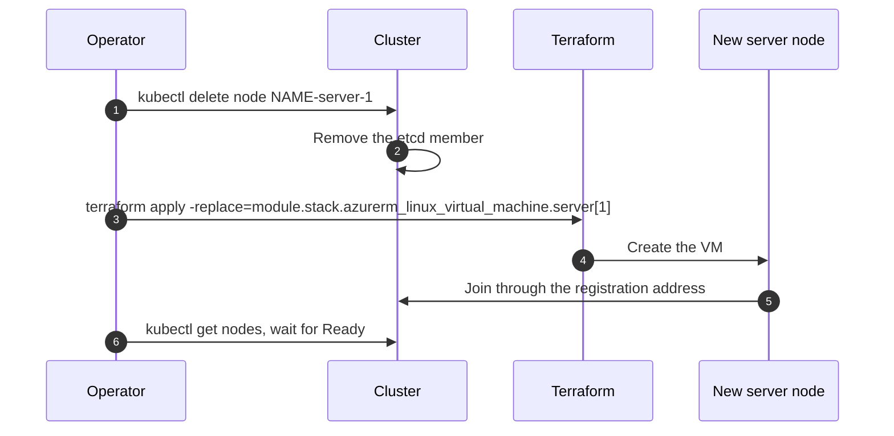
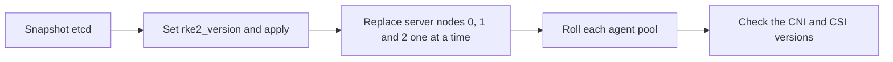

# Operations

Each procedure below is complete on its own. `module.stack` is the name of the module block in your root.

## Get access

1. With `entra_oidc` on, write `terraform output -raw kubeconfig_entra > kubeconfig`, which holds no secret,
   and sign in with `az login`; kubelogin fetches the token. Without it, write the admin kubeconfig with mode
   0600, it holds the cluster-admin key: `(umask 077 && terraform output -raw kubeconfig > kubeconfig)`.
2. Set `KUBECONFIG` to that file. The certificate is valid for one year. Terraform renews it thirty days
   before it expires, on the next apply.
3. For SSH, read the secret `ssh-private-key` from the Key Vault. The user is `admin_username`.

## Replace a server node

Terraform ignores a changed cloud-init on server nodes. Replace them one at a time.



Replace server node 0 only while the two other server nodes are healthy. A new server node 0 that gets no answer on the
registration address within `bootstrap_wait_seconds` starts a new, empty cluster. The etcd data disk of a
server is replaced with it, and the snapshots on that disk go with it.

1. Run `kubectl delete node <name>-server-<i>`.
2. Run `terraform apply -replace='module.stack.azurerm_linux_virtual_machine.server[<i>]'`.
3. Wait until the new node is Ready.
4. Repeat for the next server node.

## Roll an agent pool

A changed cloud-init, for example a new `rke2_version`, applies to new instances only.

1. Add a second pool with the same settings under a new key, for example `general2`.
2. Apply. Wait until its nodes are Ready.
3. Drain the old nodes: `kubectl drain <node> --ignore-daemonsets --delete-emptydir-data`.
4. Remove the old pool key and apply.

A reimage in place, `az vmss reimage` after the apply, also works: the instance keeps its name, and the node
password the bootstrap derives from that name and the agent token stays the same, so the server accepts the
node again. A node that joined before this version has a random password; delete its secret once before the
reimage: `kubectl -n kube-system delete secret <node>.node-password.rke2`.

## Recycle the kube-ovn pool

1. Set `cni_node_pool.enabled = false`. Apply.
2. Set `cni_node_pool.enabled = true`. Raise `bootstrap_generation` on cni-bootstrap.
3. Apply. kube-ovn then reads the new `cni` pool node.

## Back up etcd

RKE2 writes an etcd snapshot every 12 hours to `/var/lib/rancher/rke2/server/db/snapshots` on each server
node and keeps the last five, on the etcd data disk of the node. With `etcd_backup.enabled = true`, the
default, each server node runs `rke2-foundation-snapshots.timer`. The timer runs every hour and uploads each
snapshot that is at least two minutes old, with the server identity. A marker per uploaded file makes the
other runs upload nothing, so a snapshot that RKE2 writes every 12 hours goes up once. The target is the container
`etcd-snapshots` of a private storage account. The account name comes from `tags.Owner`, the cluster name
and `etcd`. The blob path is `<name>/<server>/<file>`. The account keeps blob versions and soft-deleted
blobs for `retention_days`, 30 by default, and a lifecycle rule deletes older snapshots. Only the node
subnet reaches the account. RKE2 itself uploads to S3-compatible storage only.

1. Before an upgrade, run `rke2 etcd-snapshot save` on one server node, then
   `systemctl start rke2-foundation-snapshots.service` on it two minutes later, or wait for the timer.
2. Check the upload: `journalctl -u rke2-foundation-snapshots` on the node, or list the container from a
   machine in the VNet with `az storage blob list --auth-mode login`, with a Storage Blob Data Reader grant.
3. To restore, download one file on a server node with its identity, as below. Then follow the section
   "Restore the control plane from a snapshot".

```bash
. /usr/local/lib/rke2-foundation/put-snapshot.sh
curl -sf -H "Authorization: Bearer $(imds_token https://storage.azure.com/)" -H "x-ms-version: 2021-08-06" \
  "$CONTAINER_URL/<name>/<server>/<file>" -o /var/tmp/<file>
```

## Upgrade RKE2

Upgrade one Kubernetes minor at a time. Upgrade the server nodes before the agent pools.



1. Check that every node is Ready. Take an etcd snapshot, as above.
2. Set `rke2_version` to the new release. Set `cloud_provider_image_tag` to the same Kubernetes minor. Set
   `cloud_provider_chart_version` to that minor when a chart for it exists. Apply. The plan changes no VM:
   Terraform ignores the cloud-init of the server nodes, and a scale set gives a new cloud-init to new
   instances only.
3. Replace the server nodes one at a time, as above. Wait for Ready between nodes. Replace all of them: each
   server applies the chart manifests from its own disk, and a server with the old cloud-init applies the old
   manifests again at its next restart.
4. Roll each agent pool, as above.
5. Check the CNI chart version in cni-bootstrap and the CSI drivers in the GitOps layer against the new minor.

A new OS image, a new `cloud_provider_chart_version`, a new `cloud_provider_image_tag` or a changed cloud
config follow steps 2 to 4. Step 4 is not needed when only the server manifests changed.

Rancher's system-upgrade-controller, deployed from the GitOps layer, upgrades nodes in place instead. Keep
`rke2_version` equal to the version in its plan, so that a new node does not join on an older release.

## Rotate certificates and tokens

| Credential | Lifetime | Renewal |
|---|---|---|
| CA set, five CAs | 10 years, `pki.ca_validity_hours` | Not automatic, see below |
| Node and component certificates, issued by RKE2 | 1 year | A daily timer on each node renews them when RKE2 reports fewer than 120 days left |
| Admin client certificate | 1 year, `pki.admin_validity_hours` | Terraform renews it on an apply in the last 30 days |
| Server and agent tokens | No expiry | `rke2 token rotate`, not automated by the module |
| Secrets encryption key | No expiry | `rke2 secrets-encrypt rotate-keys`, see below |
| Service account signing key | No expiry | Not supported by the module |

RKE2 renews the certificates of a node only when the node starts. With `certificate_renewal = true`, the
default, the timer `rke2-foundation-renew.timer` runs `rke2 certificate check` on each node once a day. When
a certificate is inside RKE2's 120 day window, an agent restarts `rke2-agent`, and a server stops
`rke2-server`, runs `rke2 certificate rotate` for new keys and starts again. Servers go one at a time: a
server renews only when every server is Ready and it holds the Lease `rke2-foundation-certificate-renewal`
in `kube-system`. The order and the commands are the ones Rancher Manager uses for the clusters it manages.

1. Watch the events: `kubectl get events -A --field-selector reason=CertificateExpirationWarning`. With the
   timer on, an event that stays for more than a day means a renewal did not happen; read
   `journalctl -u rke2-foundation-renew` on that node.
2. On a node, list the dates: `rke2 certificate check --output table`.
3. To renew a node now, run `RENEW_FORCE=true /usr/local/lib/rke2-foundation/renew-certificates.sh` on it.
   Without the timer, do the same by hand, one server node at a time, then the agent nodes. Stop the
   service. Run `rke2 certificate rotate`. Start the service again. A server replacement, as above, also
   issues new certificates.

To rotate the secrets encryption key, run `rke2 secrets-encrypt rotate-keys` on one server. Wait until
`rke2 secrets-encrypt status` shows `reencrypt_finished`. Then restart `rke2-server` on each server, one at a
time.

The CA certificates and keys are in the Key Vault. To renew or replace them, follow the
[RKE2 guide](https://docs.rke2.io/security/certificates) for `rke2 certificate rotate-ca`. A renewal with the
same root key is not disruptive. A new root key is disruptive: every node needs the new token and a restart,
and every pod needs a restart. The module does not automate either.

## Rotate the admin credential

Terraform renews the certificate on its own. To rotate it now:

```bash
terraform apply -replace='module.stack.module.bootstrap.tls_locally_signed_cert.admin'
```

## Scale a pool

- `node_count` is the initial size of a pool. Terraform never changes the size of a pool that exists.
- With `min_count` and `max_count`, the pool carries the cluster-autoscaler tags, and the autoscaler from
  the GitOps layer owns the size.
- To change the size by hand, scale the scale set in Azure:
  `az vmss scale --resource-group rg-<name>-nodes --name vmss-<name>-<pool> --new-capacity <n>`.
- To change the VM size or the disks of a pool, add a new pool and roll, as above.
- Azure limits the vCPUs per VM family in a subscription. A pool that cannot grow shows a quota error in the
  activity log of the scale set.

## Watch

| Signal | How |
|---|---|
| Certificates close to expiry | `kubectl get events -A --field-selector reason=CertificateExpirationWarning` |
| Nodes | `kubectl get nodes`. A server that is down also leaves the load balancer pools, which probe TCP 6443 and 9345 |
| etcd | The health command below, from any server pod |
| Snapshots | `rke2 etcd-snapshot ls` on a server |
| Cloud controller | `kubectl -n kube-system get pods -l component=cloud-controller-manager`. Restarts, or a Service without an address, point here |
| Load balancers | The Azure Monitor metric Health Probe Status on the internal and the public load balancer |

```bash
kubectl -n kube-system exec etcd-<name>-server-0 -- etcdctl \
  --cacert /var/lib/rancher/rke2/server/tls/etcd/server-ca.crt \
  --cert /var/lib/rancher/rke2/server/tls/etcd/server-client.crt \
  --key /var/lib/rancher/rke2/server/tls/etcd/server-client.key \
  --endpoints=https://<server-0-ip>:2379,https://<server-1-ip>:2379,https://<server-2-ip>:2379 endpoint health
```

## Node does not join

Where to look, in this order:

1. The serial console of the VM in the Azure portal. Boot diagnostics are on for every node.
2. SSH from a machine in the VNet, with the key in the Key Vault secret `ssh-private-key`. Nodes have no
   public address.
3. `/var/log/cloud-init-output.log`. The bootstrap lines start with `rke2-foundation:`.
4. `journalctl -u rke2-server` or `journalctl -u rke2-agent`, once the install is done.

| Log line | Cause | Action |
|---|---|---|
| `fetch-secrets: could not read <secret>` | The Key Vault refused or did not answer for 15 minutes | Check the role assignment of the node identity on the vault, the vault's network rules and the route from the subnet. Then replace the node: cloud-init runs once |
| `waiting for <address>:9345`, repeated | No server answers on the registration address | Check the server nodes and the backend health of the internal load balancer |
| `bootstrapping a new cluster` on a replaced server node 0 while a cluster exists | The registration address did not answer within `bootstrap_wait_seconds` | Replace server node 0 again, once the two other server nodes are healthy. Do not let two clusters share the load balancer |
| Node `NotReady`, reason `network plugin not ready` | The CNI is not installed yet. cni-bootstrap installs it once the servers are up, and kube-ovn needs its master node first | Wait, or check cni-bootstrap |
| Node `Ready`, pods `Pending` on taint `node.cloudprovider.kubernetes.io/uninitialized` | cloud-controller-manager is not running | Read its log in `kube-system` |

## Restore the control plane from a snapshot

Not yet rehearsed on Azure. The steps follow the [RKE2 guide](https://docs.rke2.io/datastore/backup_restore).

1. Download the snapshot file from the container on the server, as in Back up etcd. It must come from a
   cluster with the same CA set and tokens, which the Key Vault holds.
2. If no server node is left, apply to create server node 0. With nothing on the registration address it
   starts a new, empty cluster. Wait until it is Ready.
3. Stop `rke2-server` on server node 0. Copy the file to the node. Run
   `rke2 server --cluster-reset --cluster-reset-restore-path=<file>`. Start `rke2-server`.
4. Replace server node 1 and server node 2, as above, so that they join the restored cluster with an empty
   datastore.
5. Agents reconnect on their own. Their certificates come from the same CA.

## Audit log

With `cis_profile = true`, RKE2 writes `/etc/rancher/rke2/audit-policy.yaml` on each server with
`level: None`, so the API server logs nothing until the policy changes. The log goes to
`/var/lib/rancher/rke2/server/logs/audit.log` on each server. The module has no input for the policy yet. To
log requests, write a policy on each server and restart `rke2-server`, then ship the file with the logging
stack of the GitOps layer, which must tolerate the server taints.

## Build a hardened image

The module takes marketplace images only today. The plan for a Government image:

1. Start from RHEL 10 on the marketplace, the module default. The RKE2 support matrix lists 10.0 to 10.2,
   and the DISA STIG for RHEL 10 exists. Canonical's FIPS images stop at Ubuntu 22.04.
2. At build time, apply the DISA STIG profile with OpenSCAP, turn FIPS on, install `rke2-selinux` and the
   `kernel-modules-extra` build of the image kernel, open the RKE2 ports in firewalld, and preload the RKE2
   artifacts of the pinned release.
3. Publish each build as a version in a Compute Gallery.
4. Add a gallery image input to the module, which does not exist yet. Then replace the servers and roll the
   pools, as in Upgrade RKE2.

## Destroy and create again

`terraform destroy` removes every resource except the Key Vault. Azure keeps the vault soft-deleted for 90 days,
with purge protection. On the next apply with the same `name`, set `key_vault.name` to a new value.
