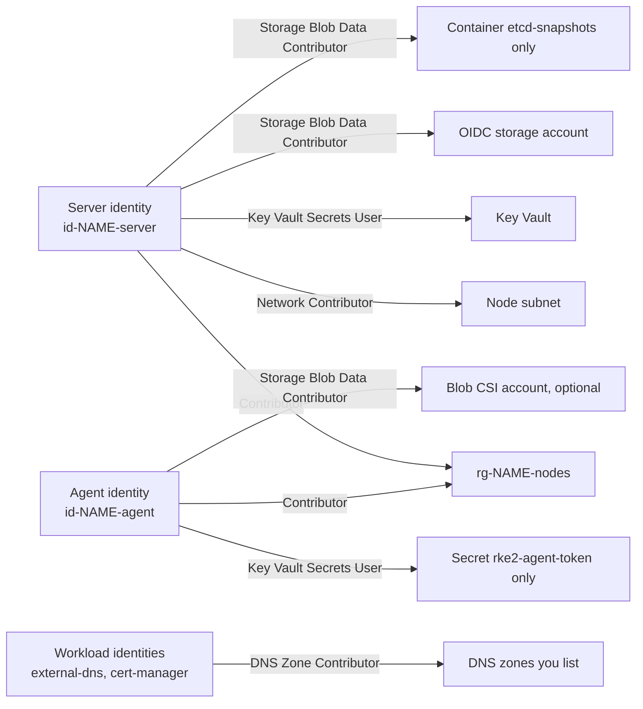

# Security

## Identities and grants

| Identity           | Runs on            | Used by                                        |
| ------------------ | ------------------ | ---------------------------------------------- |
| Server             | server nodes       | cloud-init, the snapshot upload, cloud-provider-azure, cluster-autoscaler, the CSI controller |
| Agent              | agent nodes        | cloud-init, the CSI node plugin                 |
| Workload           | pods, through Entra Workload ID | external-dns, cert-manager        |

Any pod that can reach IMDS on 169.254.169.254 can get a token for its node's identity. Block that route
with a network policy from the GitOps layer.

## Network exposure

| Port | Listener                  | Reachable from                                             |
| ---- | ------------------------- | ---------------------------------------------------------- |
| 6443 | API server                | the VNet, and the internet or `cluster_endpoint_authorized_ip_ranges` with a public endpoint |
| 9345 | RKE2 supervisor           | the VNet only                                              |
| 2379 | etcd                      | the VNet only; Azure's default rules allow VNet traffic    |
| 22   | SSH                       | the VNet only; there is no public IP on a node             |

Egress goes through the NAT Gateway. `nat_gateway_public_ips` lists its addresses for allow lists.

## Hardening options

| Input                            | Effect                                                                 |
| -------------------------------- | ---------------------------------------------------------------------- |
| `cluster_endpoint_public_access = false` | No public load balancer. Apply from inside the VNet.           |
| `cluster_endpoint_authorized_ip_ranges` | Limits the public API server to those CIDRs.                    |
| `secrets_encryption`, on by default | Encrypts Secrets at rest in etcd.                                   |
| `cis_profile`                    | Runs RKE2 with `profile: cis` and prepares the host for it.            |
| `image`                          | A FIPS marketplace image, with its purchase plan in `image.plan`. The module takes no gallery image yet. |
| `entra_oidc`                     | Entra ID as the API server's OIDC provider, for kubelogin, with cluster-admin and read-only bindings applied at bootstrap. The client certificate stays as break-glass. |

RKE2 itself ships BoringCrypto builds. Of the bundled CNIs, only Canal is rebuilt for FIPS.
